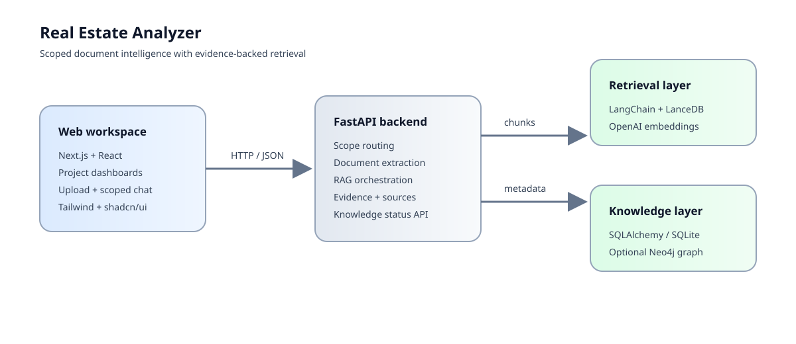

# Real Estate Analyzer

[](https://github.com/sakulvo/real-estate-analyzer/actions/workflows/ci.yml)

A project-scoped document intelligence workspace for real-estate analysis. The application combines document ingestion, evidence-backed retrieval, structured metadata, and an optional knowledge graph in a focused web interface.

> Portfolio / research project. The codebase is actively evolving and is intended for local development rather than production deployment.

## What it does

- Upload PDFs, DOCX, XLSX, PPTX, CSV, TXT, and Markdown files into explicit scopes.
- Keep project workspaces isolated while supporting broader real-estate and global knowledge views.
- Extract text, split it into chunks, and persist embeddings in LanceDB.
- Answer questions with deduplicated sources and short evidence excerpts.
- Track project and document metadata with SQLAlchemy and a local SQLite MVP.
- Optionally ingest document structure and extracted entities into Neo4j.
- Provide a Next.js interface with project dashboards, upload flows, scoped chat, and knowledge-status views.

## Architecture



- **Frontend:** Next.js, React, TypeScript, Tailwind CSS, shadcn/ui / Radix
- **API:** Python, FastAPI
- **Retrieval:** LangChain, OpenAI embeddings, LanceDB
- **Metadata:** SQLAlchemy with SQLite locally and a Postgres-ready configuration
- **Graph layer:** Neo4j foundation with safe fallback when disabled or unavailable

## Quick start

### 1. Install dependencies

PowerShell:

```powershell
git clone https://github.com/sakulvo/real-estate-analyzer.git
cd real-estate-analyzer

python -m venv .venv
.\.venv\Scripts\Activate.ps1
python -m pip install -r requirements.txt

cd frontend
npm ci
Copy-Item .env.example .env.local
cd ..
```

### 2. Configure the backend

```powershell
Copy-Item backend\.env.example backend\.env
```

Set `OPENAI_API_KEY` in `backend/.env`. For a run without Neo4j, set `GRAPH_ENABLED=false`. To enable the graph layer, follow [the local Neo4j guide](docs/LOCAL_NEO4J.md) and provide a local `NEO4J_PASSWORD`.

### 3. Run the app

```powershell
make run
```

- Frontend: http://127.0.0.1:3000
- Backend: http://127.0.0.1:8000
- API docs: http://127.0.0.1:8000/docs

For individual processes, use `make backend` and `make frontend`.

## Main routes

| Route | Purpose |
| --- | --- |
| `/brain` | Global knowledge chat |
| `/projects` | Project workspaces and uploads |
| `/projects/[projectName]` | Project detail and scoped chat |
| `/workspace` | Legacy redirect to `/brain` |
| `/system/knowledge-status` | Backend knowledge-layer status |

## Repository guide

- [PROJECT_STATUS.md](PROJECT_STATUS.md) — current product scope and implementation status
- [docs/LOCAL_NEO4J.md](docs/LOCAL_NEO4J.md) — optional graph setup
- [docs/project-structure.md](docs/project-structure.md) — module map
- [frontend/README.md](frontend/README.md) — frontend-specific notes
- [CHANGELOG.md](CHANGELOG.md) — recent implementation milestones

## Validation

The repository includes automated checks for backend compilation and schema tests, plus frontend linting and production builds. Run the local checks with:

```powershell
make check
```
